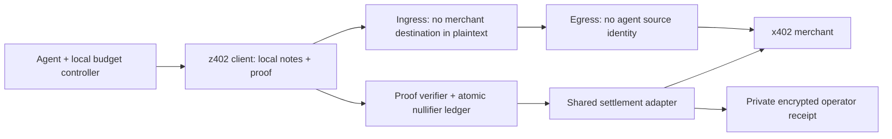

# z402: payment privacy by default — design proposal

> Implementation update: the repository now includes an experimental native Zcash
> purchase slice in `packages/z402` and `tools/z402-wallet`. It implements signed
> offers, durable local budgets, selected-output disclosures, encrypted delivery,
> and independently verifiable merchant receipts. See [the runbook](Z402_RUNBOOK.md).
> The credit ledger and rollup below remain proposals; hosted collection stays off.

Angus's direction is a free discovery/removal tool now, followed by an x402-compatible transport/payment system that prevents payments from being linked to an agent by default. This document turns that direction into testable requirements. It is a proposal, not a working protocol, security proof or launch-readiness claim. The existing local relay, disabled checkout and verify-only ZEC adapter do not implement it.

## User contract and threat model

An operator configures one supported payment client/transport once, chooses a spending budget, and the agent uses compatible paid resources without placing raw payment credentials, signatures, wallet addresses or settlement identifiers in ordinary agent-facing history/logs. Private payment receipts and operator budget/financial controls must remain accessible to the authorized operator through a separate local wallet/control surface. Automated privacy must preserve authorization and accounting, not bypass spending approvals.

The proposed primary privacy target is a merchant or public-chain observer linking a service payment to the agent's funding wallet or stable agent identity. Separate claims are required for relay operators, facilitators, network observers and a human with machine/admin access. A proof that hides a funding note does not hide HTTP identity. Endpoint logins, API keys, cookies, request content, source IP, timing and exact amounts can reconnect a payment to an agent. Colluding hops or a global traffic observer are outside an initial bounded profile unless a stronger construction and evidence address them. The product must state the achieved profile rather than promise universal anonymity.

## Candidate architecture

This is a candidate separation of roles, not an assertion that the shown arrows constitute a secure protocol. The envelope, key management, relay independence and response routing need specification and review. A single relay with plaintext requests and stable client tokens does not satisfy the ingress/egress separation.

1. **Shielded funding/credit.** Choose one supported asset/network and a reviewed note/commitment construction. A user holds spendable notes locally rather than a gateway account keyed by their agent identity. Funding, change and withdrawal patterns must be included in the anonymity analysis; matching deposit and service amounts or immediate spending can defeat the intended unlinkability. Do not invent a new cryptographic primitive.
2. **Prove authorized spend.** Define a circuit that proves ownership of an eligible unspent note, value conservation including every fee, valid change commitments and authorization of a specific payment intent. Candidate public inputs include a commitment root, domain-separated nullifier, canonical intent commitment, expiry and output commitments. The witness contains note secrets, membership path and private values. No funding wallet address or stable agent identifier belongs in the ordinary proof payload. Revealed input/output values and repeated proof fields require explicit linkability analysis. Do not claim zero knowledge until an actual reviewed proof system/verifier exists.
3. **Bind the request.** The canonical intent must bind chain, asset, recipient, amount/cap, fee cap, authenticated merchant offer, method/resource, expiry and a request-specific nonce. Specify encoding and domain separation. A proof for one merchant/resource cannot authorize a different one. Authenticate the offer end-to-end; a gateway must not be able to replace a quoted recipient or price.
4. **Prevent double spending atomically.** Verify proofs, reserve nullifiers and authorize settlement with durable transactional state. Specify retries, concurrent requests, chain reorgs, expiry, crash recovery and refunds. Settlement must not succeed twice, and a failed request must not silently lose credit. The existing relay's proposed usage-credit hook is not this anonymous ledger.
5. **Separate identity from transport.** Use independently operated ingress/egress or a reviewed anonymity transport so the party seeing the agent's network source does not also receive the merchant/settlement intent. Normalize headers, avoid stable trace IDs/accounts, pad packet sizes, and define bounded batching/delay policies. Timing, destination/content and amount correlation are measurements to test, not problems a SNARK automatically solves.
6. **Settle a supported x402 payment.** For an unchanged merchant accepting the existing `exact` scheme, a settlement gateway could present its own supported payment authorization. That hides the agent's wallet from the merchant but introduces custody/availability risks, a visible gateway payment and possible gateway correlation. It is not itself a ZK rollup. Alternatively, a merchant/facilitator adapter can explicitly accept a proposed shielded-credit scheme and verify its proof/ledger. That requires adoption; it is not universal drop-in compatibility. Pick one route after testing a concrete merchant, asset and settlement interface.
7. **Batch/prove state transitions.** A real rollup needs defined custody/exit rules, data availability, a state-transition proof, a verifier and settlement anchoring. Merely queueing HTTP requests or payments is a batch transport. Select an existing reviewed construction and document operator failure/recovery before using the word rollup as a delivered feature.
8. **Privacy at the client boundary.** Intercept the payment challenge/authorization/receipt flow before persistence, not after the ordinary logger has serialized it. Return only the resource result and a minimal private status to agent-facing history. Keep necessary receipts encrypted locally for the operator; neither telemetry nor exception paths may contain raw payment artifacts. Never alter signed wire payloads in a log filter. Refuse protected mode on unsupported endpoints/failed proof or transport health rather than silently falling back to a directly identifying payment.

## Why existing x402 is not enough

The current [HTTP transport specification](https://github.com/x402-foundation/x402/blob/main/specs/transports-v2/http.md) places payment requirements, authorizations and settlement responses in named headers. The [core specification](https://github.com/x402-foundation/x402/blob/main/specs/x402-specification-v2.md) includes payer/transaction data in settlement and sender data in its example EVM authorization. Replacing a log display does not change those wire/settlement fields.

Zcash's [protocol specification](https://zips.z.cash/protocol/protocol.pdf) provides a concrete existing example of shielded notes, commitments, nullifiers and proofs, and explains that transfers between value pools reveal the transferred amount. That is background for evaluating a construction; it does not establish that ZEC, a conversion path or a Zcash proof is accepted by a merchant's existing x402 scheme. A ZEC-to-other-asset route adds conversion fees, settlement trust and possible linkage. Do not make a cross-chain bridge a hidden assumption.

## Next bounded engineering gate

Produce a local/testnet vertical slice with one actual cooperative merchant and one chosen asset/network, using a real proof/verifier and isolated durable nullifier state. Before any paid/mainnet test, settle the specific construction, custody/exit model, privacy profile, permitted fees and operator authority. Reuse testnet where it is configured; no mainnet authorization follows from this proposal.

Required evidence:

- The actual merchant accepts the payment and returns the resource; receipts match the settled amount and all fees. A fake proof or simulated payment is labeled a fixture and cannot satisfy this gate.
- Invalid/tampered proofs, wrong destination/resource/asset/network, expired quotes, over-budget spends and concurrent replay all fail before a transfer; no credit is lost on failure. Crash/retry/reorg behavior is exercised.
- Two clients with separate funding identities make repeated requests. Capture client persistence, relay logs, merchant logs, facilitator records and public chain data. Enumerate which party sees each identifier and test how accurately payments can be matched to clients using timing, amounts, content and headers. Two clients exercise separation but do not demonstrate a production anonymity set.
- Logs, exceptions, telemetry and checkpoints receive no raw payment artifacts by default. The resource result remains useful; private operator receipts and budget enforcement remain intact.
- Independent cryptographic review of the construction and verifier precedes any production anonymity claim. Launch copy names the precise tested adversary and compatibility profile.

The free cleaner can reveal retained local traces and remove selected supported threads today. Demand validation for z402 should involve operators whose agents already purchase APIs and who can show a recurring wallet/activity-linkage problem; tool usage alone does not prove demand for a shielded payment protocol.
